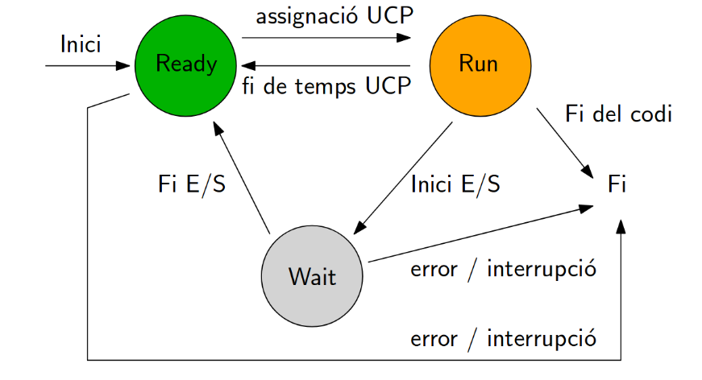

# 3. Estats d'un Procés:
[INDEX](https://github.com/rramonb-esliceu/rramonb-esliceu/blob/master/sistemes/processos/00_Introduccio.md)
## 3.1. Estats Actius
- **Execució:** El procés està actualment sent executat per la CPU.
- **Preparat:** El procés està llest per ser executat però està esperant el seu torn.
- **Bloquejat:** El procés està temporalment inactiu a causa de l'espera d'algun esdeveniment extern.
## 3.2. Estats Inactius
- **Suspès Bloquejat:** El procés està aturat i no pot continuar fins que es desbloquegi explícitament.
- **Suspès Preparat:** El procés està aturat però llest per ser reprendre.
## 3.3. Imatge estats d'un process
